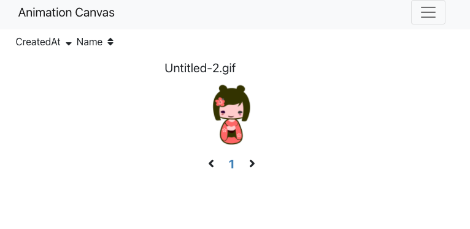

# Packages
| Package | Description |
| - | - |
|<br>firebase| v8, DB And Serverless|
|<br>node| v14, Server Side|
|<br>react| v17, Web Framework |
|<br>bootstrap| v5, CSS Framework|
|<br>sweetalert2| Modal, Input Form|
|moment|Time Format|
|cypress|E2E Test|

# Run
- FrontEnd : React
  ```
  npm run start
  ```
  http://localhost:8900/
- BackEnd : Firebase Emulator
  ```
  npm run e:start
  ```
  http://localhost:8000/

# Deploy
- All : ```firebase deploy```
- Only Front End
  - prod : ```firebase deploy --only hosting:prod```
  - stage : ```firebase deploy --only hosting:stage```
- Only Functions
  - ```firebase deploy --only functions```

# Pages
## Animation Gallery


# Link
https://ani-canvas.art/
